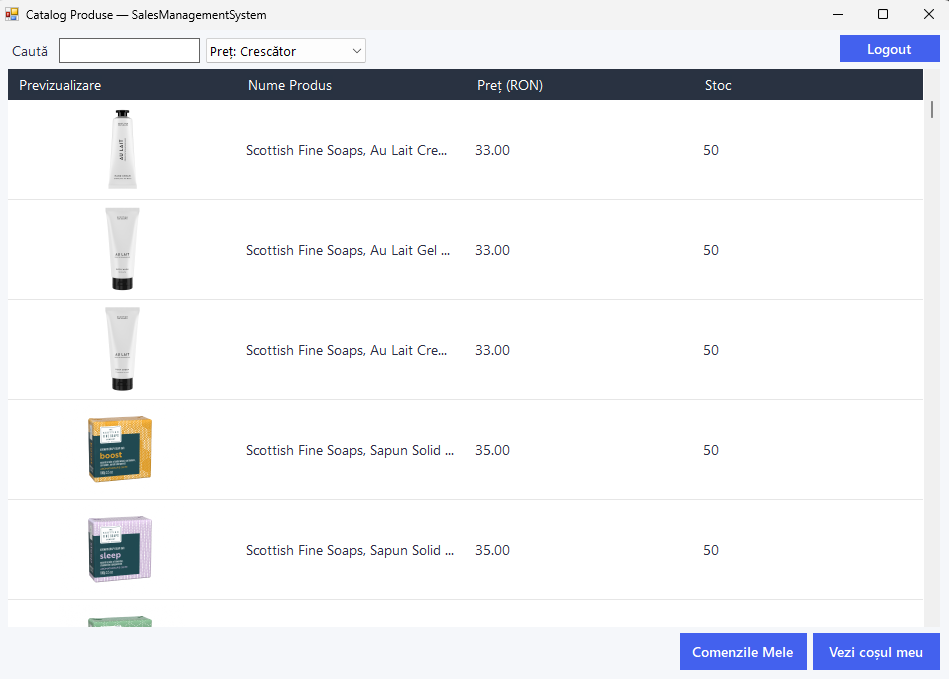
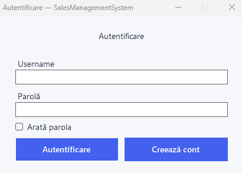
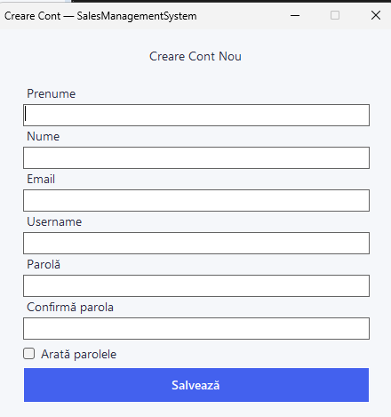
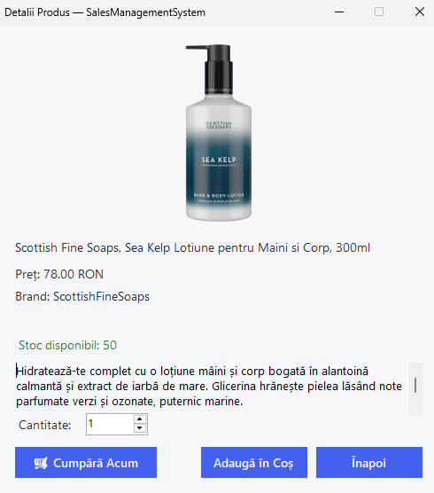
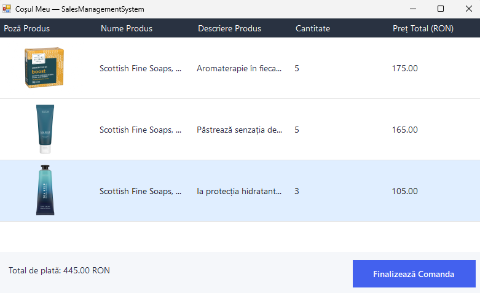
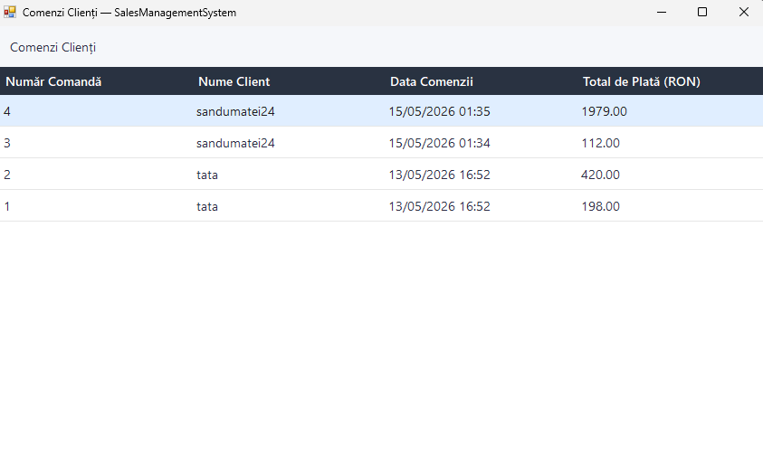
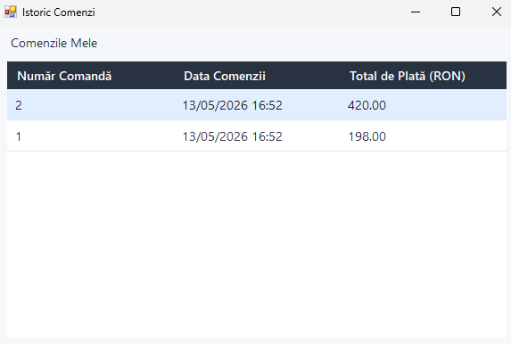
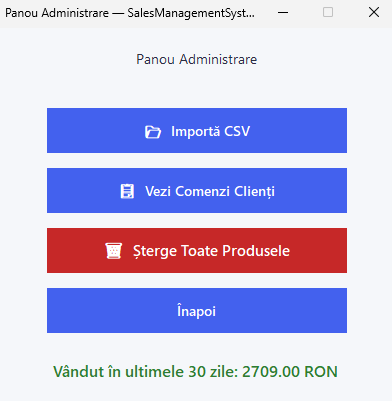
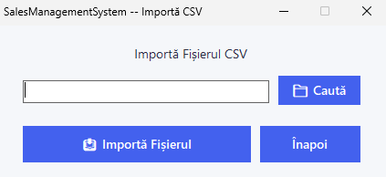

# Sales Management System

*Academic Project for Windows Application Programming (PAW) - 2026*

**Theme:** Sales Management (Gestiune Vânzări)  
**Type:** Individual Project  
**Framework:** Windows Forms, .NET Framework 4.8, Visual Studio 2022  

---

## Context & "Taking It a Step Further"

The assigned theme for this academic project was **"Sales Management"**. However, I wanted to build something that bridges the gap between a standard university assignment and a real-world application. 

Instead of generating dummy data, I used an actual, public CSV export from a real Wix eCommerce platform (**Salesfactory**). By seeding the local SQL Server database with real products, authentic descriptions, live URLs, and accurate pricing, I created a much more tangible and complex development environment. 

This application functions as a complete eCommerce platform with a strictly separated 3-tier architecture, covering everything from user authentication to complex transactional logic for checkout and stock management.

---

## Grading Criteria Mapping

To facilitate the evaluation process, here is how the project fulfills the core requirements:

* **1p - Data Model Implementation:** The project includes multiple interconnected models (`User`, `Product`, `ShoppingCart`, `Transaction`), well above the required minimum of 3.
* **1p - Data Display Mechanisms:** Advanced use of `DataGridView` elements to cleanly display Product Catalogs, Cart Items, Order Histories, and Admin Dashboards.
* **1p - Entity Creation Mechanisms:** Registration forms for new users, adding items to the session cart, creating orders, and an Admin CSV importer for bulk creating products.
* **1p - Entity Deletion Mechanisms:** Admins can delete specific products or execute a global wipe of the catalog.
* **1p - Entity Editing Mechanisms:** Admins can edit product details (price, stock, descriptions) through a dedicated `EditProductForm`.
* **2p - SQL Database Integration:** The application uses a robust SQL Server backend, heavily relying on **Dapper** for parameterized, injection-safe querying and complex transactions.
* **2p - Code Styling & Clean Code:** Strict adherence to C# conventions. UI initialization is strictly kept within `.Designer.cs` files (no dynamic runtime UI generation). Common behaviors are abstracted (e.g., `ImageService`), and database logic is fully encapsulated within the Repository Pattern (`ProductRepository`, `OrderRepository`).

---

## Architecture Highlights & "Cool Code"

This section serves as a technical notebook to highlight specific decisions that demonstrate a deep understanding of the .NET ecosystem.

### 1. Connection String Security & Separation
A common anti-pattern in beginner desktop apps is hardcoding the SQL connection string directly inside the Form classes. To mimic production standards, I decoupled the database configuration by storing the connection string securely inside `App.config`:

```xml
<connectionStrings>
    <add name="SalesDb"
         connectionString="Server=(localdb)\MSSQLLocalDB;Database=SalesManagementSystem;Integrated Security=True;"
         providerName="System.Data.SqlClient" />
</connectionStrings>
```
I then created a static `ConfigHelper` class to extract it via `ConfigurationManager`. This ensures that if the server environment changes, I only have to update a single XML configuration file without recompiling the entire C# application.

### 2. Database Access: Why Dapper?
When deciding on a database access technology, I explicitly chose **Dapper** (a Micro-ORM) over heavier frameworks like Entity Framework or outdated approaches like ADO.NET DataSets. 

* **Speed & Control:** Dapper maps SQL results directly to C# objects almost as fast as a raw `SqlDataReader`. It gave me absolute control over my queries.
* **Atomic Transactions:** Dealing with stock means dealing with concurrency. Dapper allowed me to easily pass an `SqlTransaction` across multiple operations to ensure that creating an order and decrementing stock happens atomically.

```csharp
// Proof of Concept: Atomic Transactions with Dapper
public bool PlaceOrder(Guid userId, List<Product> items)
{
    using (var connection = new SqlConnection(_connectionString))
    {
        connection.Open();
        using (var transaction = connection.BeginTransaction())
        {
            try
            {
                // 1. Insert Order
                int orderId = connection.QuerySingle<int>(
                    insertOrderSql, new { UserId = userId, TotalAmount = totalAmount }, transaction);

                // 2. Insert Items & 3. Update Stock safely
                foreach (var item in items)
                {
                    InsertItem(connection, orderId, item, transaction);
                    UpdateStock(connection, item, transaction); 
                }

                transaction.Commit(); // Atomic success
                return true;
            }
            catch
            {
                transaction.Rollback(); // Safe failure
                throw;
            }
        }
    }
}
```

### 3. The Image Processing Challenge: PictureBox vs. DataGridView
A major technical hurdle was efficiently rendering real-world images from the Wix CSV URLs into a dynamic list.

**The naive approach:** Standard WinForms tutorials suggest using a `PictureBox`. While `PictureBox.LoadAsync(url)` works great for a *single* static image on a profile page, it completely falls apart when rendering dozens of dynamic products in a list.

**The Solution:** Because the catalog is a `DataGridView`, I had to map images directly into a `DataGridViewImageColumn`. To prevent the UI thread from freezing while fetching external Wix media URLs, I built a custom, asynchronous `ImageService`. It fetches the byte stream via `HttpClient`, converts it into a `Bitmap` in memory (`MemoryStream`), and safely assigns it to the grid cells.


*(Showcasing the custom async image rendering inside a DataGridView)*

```csharp
// Proof of Concept: Asynchronous DataGrid Image Mapping
public async Task<Image> GetImageAsync(string imageUrl)
{
    string fullImageUrl = ResolveImageUrl(imageUrl); // Parses Wix format
    if (string.IsNullOrEmpty(fullImageUrl)) return null;

    try
    {
        var response = await _httpClient.GetAsync(fullImageUrl);
        if (!response.IsSuccessStatusCode) return null;

        byte[] imageBytes = await response.Content.ReadAsByteArrayAsync();
        
        // Convert stream to Bitmap safely without locking memory
        using (var ms = new System.IO.MemoryStream(imageBytes))
        {
            return new Bitmap(Image.FromStream(ms));
        }
    }
    catch
    {
        return null; // Fallback so the grid never crashes
    }
}
```

### 4. Stateful Session Management
To manage the shopping cart efficiently without unnecessarily hitting the database on every click, I implemented a static `ShoppingCart` class. This acts as an in-memory session state while the application is running. It aggregates products added by the user until checkout, at which point the entire collection is serialized into the database transactionally.

---

## Application Workflow & Screenshots

### Authentication
**Login Screen**  


**Create Account**  


### Client Workflow
**Product Details & Add to Cart**  


**Shopping Cart & Checkout**  


**Client Order History**  


**Detailed Order Invoice**  


### Administrator Workflow
**Admin Dashboard**  


**Admin CSV Bulk Import**  

